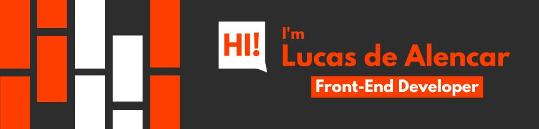

- I like the idea that the simplest solution is almost always the best.
- I'm fascinated by coding best practices.
- I'm a competitive person who enjoys challenges.
- I ❤️ FOSS.

My journey into programming started as a hobby, and now I'm immersed in developing my React portfolio projects while expanding my skills in Node.js.

### Languages 📓

### Frontend 🖥️

### Backend 💽

### GitHub Analytics 📊

 

  
  
  

 
 

### Follow me on 👍

